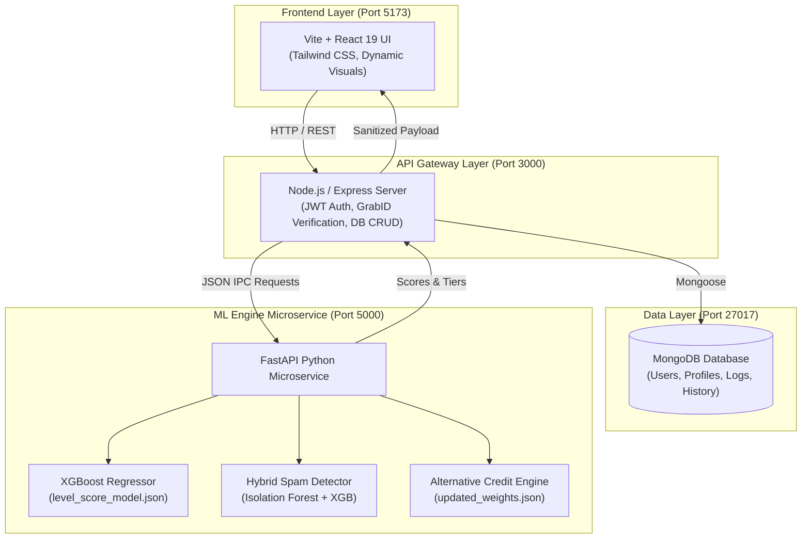

# Incentra – ML-Powered Alternative Credit Scoring System 🚀

[](https://python.org)
[](https://fastapi.tiangolo.com)
[](https://xgboost.ai)
[](https://nodejs.org)
[](https://react.dev)
[](https://mongodb.com)

**Incentra** is an end-to-end fintech platform and machine learning underwriting engine designed to eliminate the "credit invisible" barrier for gig-economy workers (**ride-hailing drivers, micro-merchants, and last-mile delivery couriers**). Inspired by behavioral loyalty frameworks (e.g., Microsoft Rewards), Incentra transforms daily operational discipline, platform consistency, cashflow velocity, and peer ranking into a dynamic **Alternative Credit Score (300–850)** and a **Tiered Level Score (0–1000)**.

---

## 💡 Problem Statement

Many individuals, particularly those in the gig economy or emerging markets, are denied access to vital financial products due to the **absence of a formal, traditional credit history**. Their consistent performance and financial reliability are often overlooked by conventional scoring models.

### The Critical Need:
* Traditional scoring models are rigid and fail to recognize reliability demonstrated outside of formal banking systems.
* The lack of fair, transparent evaluations hinders long-term economic growth and access to emergency support for a significant population.
* A comprehensive, data-driven, and equitable system is required to unlock financial inclusion.

---

## ✨ Solution: Incentra - Fair & Equitable Alternative Credit Scoring

**Incentra** provides a transparent and accurate assessment of creditworthiness for the underserved by leveraging operational data to create a reliable and verifiable credit profile.

### Innovation Highlights
* **Comprehensive Evaluation:** The final score combines a calculated **Credit Score**, an intrinsic **Level Score** (G.R.A.B Tiers), and robust **Spam Detection**.
* **Dynamic Tiers (G.R.A.B):** Users are assigned a dynamic tier—**G-Gold, R-Ruby, A-Amber, B-Bronze**—that reflects their creditworthiness and unlocks progressive benefits and access to financial products.
* **Fraud Integrity:** Utilizes cutting-edge algorithms like **Isolation Forest** for real-time **Spam and Anomaly Detection**, ensuring system fairness and data integrity.
* **Initial Boost:** Rewards users with an immediate initial boost based on past engagements, quickly establishing a reliable baseline for assessment.

---

## 🌟 Key Engineering Features

- **Microservice Architecture**: Decoupled stack featuring a React 19 single-page app, an Express.js API gateway, and a high-performance Python FastAPI ML microservice.
- **10,000 Synthetic Cohort Financial Dataset**: Domain-faithful stochastic dataset modeled across Drivers (45%), Merchants (30%), and Delivery couriers (25%) with 36 operational and financial dimensions.
- **Regulatory Monotonic Risk Ordering**: Basel II/III-compliant tier sorting where default rates decrease monotonically from **Bronze (50.4%) → Amber (21.9%) → Ruby (5.2%) → Gold (1.4%)**.
- **Data-Driven Empirical Weight Calibration**: Penalized constrained Ridge regression replaces arbitrary heuristics with mathematically optimal operational weights.
- **Production-Trained XGBoost Level Score Model**: Full-cohort gradient-boosted regressor explaining **91.3%** of out-of-sample variance ($R^2 = 0.9132$, Test RMSE = $69.33$ points).
- **Hybrid Anti-Farming & Spam Mitigation**: Blended unsupervised Isolation Forest anomaly detection (30%) + supervised tree classification (70%) protecting against artificial engagement farming and botting.
- **Fair Lending & Algorithmic Audit**: Certified Four-Fifths compliance with a Gender Disparate Impact Ratio (DIR) of **0.985** ($\ge 0.80$ threshold).

---

## 🏛️ System Architecture



---

## 📊 The 4-Tier Monotonic Risk Hierarchy

Incentra stratifies platform users into four behavioral and credit eligibility tiers based on cumulative operational consistency:

| Tier | Driver Cutoff | Merchant Cutoff | Delivery Cutoff | Default Rate | Credit Multiplier | Credit Policy |
| :--- | :---: | :---: | :---: | :---: | :---: | :--- |
| 🥇 **Gold** | $> 750$ | $> 700$ | $> 740$ | **1.43%** | $1.75\times$ | Unsecured micro-loans up to $3,500; lowest APR band. |
| 🔴 **Ruby** | $501 - 750$ | $451 - 700$ | $481 - 740$ | **5.22%** | $1.50\times$ | Near-prime revolving credit lines up to $1,800. |
| 🟡 **Amber** | $251 - 500$ | $201 - 450$ | $221 - 480$ | **21.92%** | $1.25\times$ | Starter micro-advances up to $600 with direct payout deduction. |
| 🥉 **Bronze** | $\le 250$ | $\le 200$ | $\le 220$ | **50.38%** | $1.00\times$ | Credit rebuilding; micro-advances ($150) requiring daily repayment holds. |

---

## 🤖 Machine Learning Benchmarks & Methodology

All models were evaluated using an 80/20 stratified split and 5-Fold Stratified Cross-Validation on the 10,000 financial profile cohort:

### 1. Credit Delinquency Prediction (Binary Classification)

| Model | Train ROC-AUC | Test ROC-AUC | Overfit Gap | 5-Fold CV Mean | KS Statistic | Test F1-Score |
| :--- | :---: | :---: | :---: | :---: | :---: | :---: |
| **Logistic Regression (L2)** | 0.8317 | **0.7999** | **0.0318** (3.1%) | 0.8250 ± 0.016 | 0.5112 | 0.4480 |
| **Random Forest (Balanced)** | 0.9525 | **0.7977** | 0.1548 | 0.8198 ± 0.014 | 0.5284 | 0.4710 |
| **Champion XGBoost Classifier** | 0.9761 | **0.7966** | 0.1795 | **0.8137 ± 0.012** | **0.5304** | **0.4612** |

### 2. Level Score XGBoost Regressor
- **Architecture**: Gradient-Boosted Trees (`n_estimators=250`, `max_depth=6`, `learning_rate=0.06`, subsample = `0.85`).
- **Variance Explained ($R^2$)**: **0.9132** (Out-of-sample Test Set) | Train $R^2$: 0.9587 (Delta: 4.5%).
- **Error Margin**: Test RMSE = $69.33$ points (out of 1000 scale, $\approx 6.9\%$ error).
- **Exported Binary**: `ml/models/level_score_model.json`.

---

## 📐 Core Scoring Formula

The final credit score is calculated using a complex, weighted formula incorporating regional/global performance, behavior, loyalty, and demographic attributes:

$$
\text{FinalScore} = \text{clip}\left(100 \cdot \left[\lambda_r \cdot p_r \cdot \frac{\sum_k w_{r,k} \sum_{j \in k} \alpha_{r,k,j} x_{r,i,j} + w^B \cdot B_{r,i} + w^D \cdot D_{r,i}}{\sum_k w_{r,k} + w^D + w^L + w^B} + (1-\lambda_r) \cdot p_{i}^{\text{global}} + \text{Adj}_r\right], 0, 100\right) + \Delta_{\text{adj}}
$$

---

## 🔑 Pre-Seeded Test Accounts

The MongoDB database is pre-populated with accounts covering all 4 tiers and gig roles for testing:

| Email | Password | Role | Level Score | Tier | Alternative Credit Score |
| :--- | :---: | :---: | :---: | :---: | :---: |
| `driver@incentra.com` | `password123` | Driver | **810** | **Gold** | **348.0** |
| `ruby_driver@incentra.com` | `password123` | Driver | **640** | **Ruby** | **281.1** |
| `amber_driver@incentra.com` | `password123` | Driver | **400** | **Amber** | **215.4** |
| `bronze_driver@incentra.com` | `password123` | Driver | **170** | **Bronze** | **150.2** |
| `merchant@incentra.com` | `password123` | Merchant | **840** | **Gold** | **315.6** |
| `delivery@incentra.com` | `password123` | Delivery Partner | **770** | **Gold** | **233.1** |

---

## ⚡ Quick Start & Execution

### Option 1: Automatic One-Click Launcher (PowerShell)
From the project root:
```powershell
.\start_all.ps1
```

### Option 2: Step-by-Step Manual Start

#### 1. Database (Docker MongoDB)
```powershell
docker run -d --name incentra-mongo -p 27017:27017 mongo:latest
```

#### 2. Seed Database
```powershell
cd backend
npm install
node seed.js
```

#### 3. Python ML Microservice
```powershell
cd ml
pip install -r requirements.txt
python server.py
```
*(Runs on `http://localhost:5000`)*

#### 4. Node.js Express Gateway
```powershell
cd backend
node server.js
```
*(Runs on `http://localhost:3000`)*

#### 5. Vite React Frontend
```powershell
cd frontend
npm install
npm run dev
```
*(Open [http://localhost:5173](http://localhost:5173))*

---

## 📂 Repository Structure

```
Incentra/
├── analysis/
│   └── incentra_credit_scoring_analysis.ipynb   # Complete data science & modeling notebook
├── backend/
│   ├── controllers/                             # Scoring, auth, profile controllers
│   ├── models/                                  # Driver, Merchant, Delivery, User schemas
│   ├── routes/                                  # Express API routes
│   ├── seed.js                                  # Multi-tier database seeding script
│   └── server.js                                # Express gateway entrypoint
├── data/
│   └── incentra_10k_synthetic_financial_profiles.csv  # 10,000 synthesized financial profiles
├── frontend/
│   ├── src/                                     # React components, dashboard, login views
│   └── package.json
├── ml/
│   ├── models/level_score_model.json            # Serialized XGBoost Regressor
│   ├── final_credit_score.py                    # Multi-factor alternative credit scoring
│   ├── hybridspamdetector.py                    # Isolation Forest + XGBoost spam mitigation
│   ├── level_score.py                           # Behavioral level scoring & inactivity logic
│   ├── ml_model_module.py                       # Model loader & inference wrapper
│   ├── server.py                                # FastAPI microservice server
│   ├── updated_weights.json                     # Empirical calibrated weights
│   └── utils.py                                 # Role tiers & feature weights
├── scripts/
│   ├── create_and_execute_notebook.py           # Automated notebook runner & exporter
│   ├── generate_4tier_dataset.py                # 4-tier synthetic cohort generator
│   └── test_tiers.py                            # End-to-end tier validation script
├── README.md                                    # Project documentation
└── start_all.ps1                                # One-click PowerShell process launcher
```

---

## 🔗 Project Links

* **Demo Video:** [Incentra Demo](https://www.youtube.com/watch?v=jF7RlG8O148&t=6s)
* **GitHub Repository:** [Aurialedge/Incentra](https://github.com/Aurialedge/Incentra.git)
